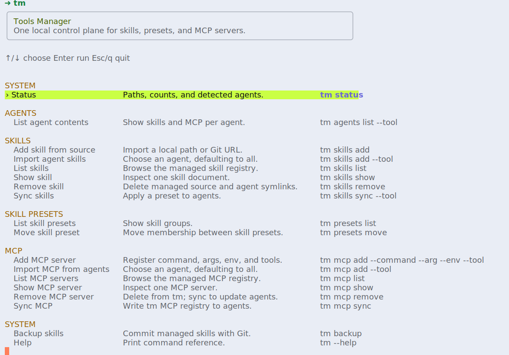
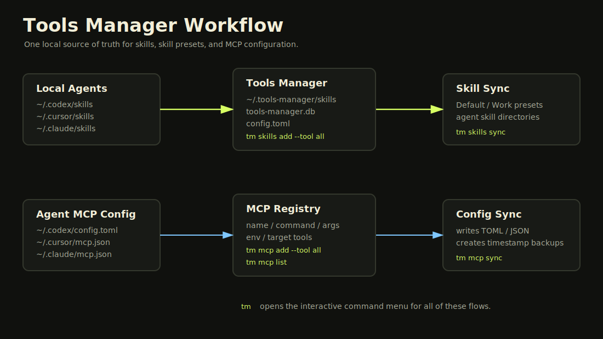

# Tools Manager

[中文文档](README.zh-CN.md)

Tools Manager (`tm`) is a Bun-powered CLI for managing AI agent skills and MCP server configuration across Codex, Claude Code, Cursor, and OpenCode.

It gives you one local source of truth for:

- Skills stored under `~/.tools-manager/skills`
- Skill presets that group skills for different agents or workflows
- MCP servers stored in the Tools Manager database and synced into agent config files

Open `tm` with no arguments when you want a guided command picker instead of remembering every subcommand:



The diagram below shows how skills and MCP servers move between local agents and the Tools Manager store:



## Requirements

- Bun `>= 1.3.0`
- Git, for importing skills from Git URLs and running `tm backup`

## Installation

Install globally:

```bash
npm install -g tools-manager
```

Verify the CLI:

```bash
tm status
```

For source checkout usage, see [Development](#development).


## Quick Start

Import all existing local agent skills into Tools Manager, then sync them back to all supported agents:

```bash
# Create the Tools Manager home directory and default config.
tm init

# Import existing skills from Codex, Claude Code, Cursor, and OpenCode.
tm skills add --tool all

# Show the skills now managed by Tools Manager.
tm skills list

# Sync the default skill group back to all supported agents.
tm skills sync
```

If you have not linked or installed the package yet, use:

```bash
bun run tm init
bun run tm skills add --tool all
bun run tm skills list
bun run tm skills sync
```

By default, Tools Manager writes state to:

```text
~/.tools-manager
```

Set `TOOLS_MANAGER_HOME` to use a custom manager root.

Run `tm` with no arguments to open an interactive command menu:

```bash
tm
```

The menu lets you choose common skill, skill preset, MCP, agent, and backup commands with arrow keys. It includes manual add flows for skill sources and MCP servers, plus import flows from existing agents. Tool parameters use an option picker with `all` selected by default. After a command runs, press `Enter` or `Esc` to return to the menu.

## Skills

Add a local skill directory:

```bash
tm skills add ./my-skill
```

Add existing skills from one local agent:

```bash
tm skills add --tool codex
tm skills add --tool cursor
tm skills add --tool claude_code
tm skills add --tool opencode
```

Import existing skills from all supported local agents:

```bash
tm skills add --tool all
```

Agent imports copy skills into `~/.tools-manager/skills`, then replace the original local agent skill directories with symlinks to the managed copies.

Import a skill from Git:

```bash
tm skills add 'git@gitlab.company.com:group/repo.git#main:path/to/skill'
```

If the source contains multiple skill directories, all discovered skills are imported. Existing skills with the same name are updated.

See [Remote Skill Repositories](docs/remote-skill-repositories.md) for the expected repository layout.

List managed skills:

```bash
tm skills list
```

List skills currently visible to local agents:

```bash
tm skills list --tool codex
tm skills list --tool all
```

Show one managed skill:

```bash
tm skills show my-skill
```

Remove a managed skill:

```bash
tm skills remove my-skill
```

If agent skill directories contain symlinks to the managed skill source, Tools Manager shows them and asks for confirmation before deleting both the managed source and those agent symlinks. Use `--yes` for non-interactive removal:

```bash
tm skills remove my-skill --yes
```

Sync skills to agent skill directories:

```bash
tm skills sync
tm skills sync Work --tool cursor
tm skills sync --mode copy
tm skills sync Work --tool codex --mode symlink
```

`tm skills sync` is the main command for making agent tools see your managed skills.

Defaults:

- `tm skills sync` syncs preset `Default`
- `tm skills sync` syncs to `--tool all`, which means Codex, Claude Code, Cursor, and OpenCode
- `tm skills sync` uses the configured `sync_mode`; pass `--mode symlink` or `--mode copy` to override it for one run

In short: after adding or moving skills, run `tm skills sync`.

## Skill Presets

Skill presets are named groups of skills. They help you decide which skills should be synced together.

For example, you can keep everyday skills in `Default`, and work-only skills in `Work`. Imported skills are added to `Default` automatically.

List skill presets:

```bash
tm presets list
```

Move one skill from one preset to another:

```bash
tm presets move-skill my-skill Default Work
```

Move all skills from one skill preset to another:

```bash
tm presets move Default Work
```

After changing preset membership, use `tm skills sync` to update agent skill directories.

## MCP Servers

Add an MCP server to Tools Manager:

```bash
tm mcp add playwright --command npx --arg @playwright/mcp@latest --tool codex
```

Add existing MCP servers from agent config files:

```bash
tm mcp add --tool codex
tm mcp add --tool all
```

List managed MCP servers:

```bash
tm mcp list
```

List MCP servers currently configured in local agent config files:

```bash
tm mcp list --tool codex
tm mcp list --tool all
```

Show one managed MCP server:

```bash
tm mcp show playwright
```

Remove a managed MCP server:

```bash
tm mcp remove playwright
```

Sync managed MCP servers back to agent config files:

```bash
tm mcp sync
tm mcp sync --tool codex
```

Defaults:

- `tm mcp sync` uses `--tool all`
- Sync creates timestamped backups before writing config files

Supported config targets:

```text
codex       -> ~/.codex/config.toml
claude_code -> ~/.claude/mcp.json
cursor      -> ~/.cursor/mcp.json
opencode    -> ~/.config/opencode/opencode.json
```

## Backup

Back up managed skills with Git:

```bash
tm backup
```

`tm backup` initializes a Git repo in `~/.tools-manager/skills` if needed, commits skill changes, and pushes when `git_remote` is configured in `~/.tools-manager/config.toml`.

## Command Reference

```bash
tm init
tm status [--json]
tm agents list [--tool <tool|all>] [--json]
tm skills add <source>
tm skills add --tool <tool|all>
tm skills list [--json]
tm skills list --tool <tool|all> [--json]
tm skills show <name> [--json]
tm skills remove <name> [--yes]
tm skills sync [preset] [--tool <tool|all>] [--mode <symlink|copy>]
tm presets list [--json]
tm presets move-skill <skill> <from> <to>
tm presets move <from> <to>
tm mcp add <name> --command <cmd> [--arg value] [--env K=V] [--tool <tool|all>]
tm mcp add --tool <tool|all>
tm mcp list [--json]
tm mcp list --tool <tool|all> [--json]
tm mcp show <name> [--json]
tm mcp remove <name>
tm mcp sync [--tool <tool|all>]
tm backup
```

Supported tools:

```text
codex
claude_code
cursor
opencode
all
```

## Development

Install dependencies and run checks:

```bash
bun install
bun run check
```

This repository pins npm and Bun installs to the npmmirror registry through `.npmrc` and `bunfig.toml`.

Run the CLI through the package script:

```bash
bun run tm status
bun run tm skills list
```

Build the publishable CLI bundle:

```bash
bun run build
ls -la dist
```

Test the `tm` binary exactly as consumers will run it:

```bash
npm link
tm status
tm skills list
npm unlink -g tools-manager
```

## Publishing

Before publishing:

```bash
bun run release:dry
```

Review the dry-run output. It should include only:

- `package.json`
- `README.md`
- `README.zh-CN.md`
- `dist/**`
- `docs/**`

Publish:

```bash
bun run release
```

Publish with a version bump:

```bash
bun run release:patch
bun run release:minor
bun run release:major
```

After publishing, test install in a clean shell:

```bash
npm install -g tools-manager
tm --help
tm status
```

## Notes

- `tm skills add` supports local folders, GitHub URLs, internal GitLab URLs, SSH Git URLs, and `#ref:path/to/skill`.
- Git authentication is delegated to your local Git setup: SSH keys, VPN, credential helpers, and tokens. Private HTTPS repositories with 2FA need a personal access token, or use an SSH Git URL.
- `tm skills add --codex` and `tm skills add --all` are kept as compatibility aliases.
- `tm skills remove` deletes the managed skill files, removes preset membership, and removes agent symlinks that point to the managed source after confirmation.
- `tm mcp remove` deletes the server from Tools Manager; run `tm mcp sync` to update agent config files.
- `--json` is available on list/status-style commands for scripting.
